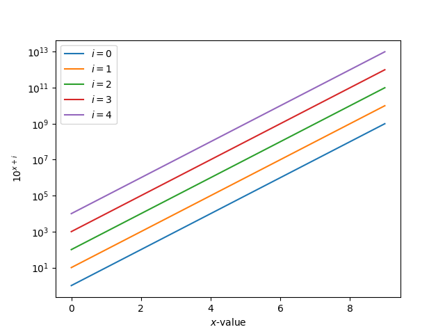
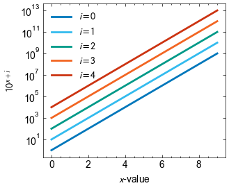
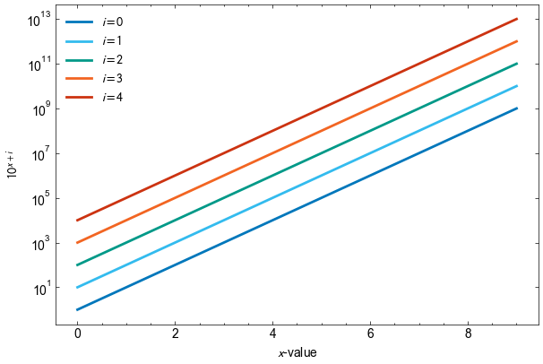
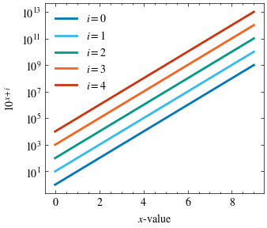
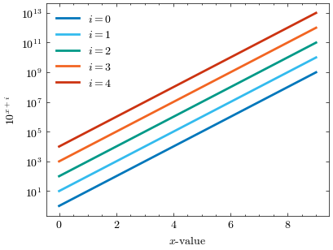
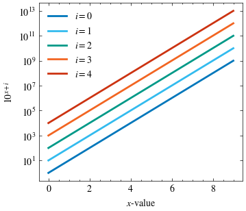

SOColors
========

Installing
----------

This is a python package, and can be installed using `pip install socolors`.

About
-----

This tool contains style sheets, heavily inspired by
[scienceplots](https://github.com/garrettj403/SciencePlots),
for styling figures produced with matplotlib. It allows you to prepare figures
already designed for journal styles. Notably it:

a) Uses the main SO color as a line color (branding can be fun too!)

b) Use a colorblind-friendly default set of line colors from
   [Paul Tol's notes](https://sronpersonalpages.nl/~pault/). The default matplotlib
   line colors are not colorblind friendly.

c) Uses the correct fonts and plot sizes for various journals, providing
   consistency. It also allows one-line swapping between journal styles, reducing
   any duplicated effort in the case where we need to swap journals at the last
   minute.

d) It turns on 'constrained layout' by default, providing journal-ready figure
   margins.

Best Practices
--------------

a) Always save your figures in a _vector_ format like `.pdf` or `.svg` whenever
   possible, especially when you are going to be including them in a publication.

b) Make sure that your figures look good in your paper _without_ using tools like
   `trim` or scaling them with things like `\columnwidth`. PDFs have dimensions,
   and if they're correct everything will fit without needing to do this.

c) If you must save as a `.png` or `.jpg` (known as 'raster' formats), make sure
   to set `dpi=300` for high quality outputs.

d) If you need to modify the size of your figure, try to only do so vertically.
   The units of `figsize=()` are in inches; for the journals below we state
   their column width or 'full width' for figures than span both columns. Use
   that as your x-size, so `figsize=(fixed, variable)` to ensure that your figure
   always fits neatly into the page layout.

Here's a simple figure, using the basic maptlotlib settings (see example.py):



We're going to style this image below using `socolors`. To use any of our styles,
you just need to:
```python3
import matplotlib.pyplot as plt
import socolors

plt.style.use("$STYLE_NAME")
```
where `$STYLE_NAME` is the style name we list below.

Simple and Interactive Styles
-----------------------------

### sobase

`sobase` is a basic style that provides sans-serif fonts and the SO color scheme.



### notebook

`notebook` is a useful style when working in notebooks. It provides an expanded
plot area, similar to the default matplotlib style, but provides better margins,
fonts, and the SO color scheme.




Journal-Specific Styles
-----------------------

The styles in this section are designed to match, as closely as possible, the styles
of the journals that they represent. If you want to publish in a journal and it's
not available, please let us know and we can add it easily!

Next to each journal, we specify the approximate column width. If you need to change
the size/shape of your figure, keep this fixed as the x-width, otherwise it'll spill
out of the column.

### MNRAS

MNRAS uses 'Times' as its font, in 10pt. It has a column wdith of 3.3 in, and full wdith
of approximately 6.9 in. We provide `mnras` and `mnras-fullwidth` to handle this.



### JCAP

JCAP uses 'Computer Modern', also known as 'the LaTeX font', in 11pt. This is usually
too large for figures, so we choose a 10pt font consistent with their caption sizing.
JCAP has a single column, so we provide a default `jcap` with width 4.0 in and a
`jcap-fullwdith` spanning the entire column with width 6.1 in.



### ApJ

ApJ uses 'Times' as their font in 10pt. The only difference with respect to MNRAS here
is the widths, which are slightly wider at 3.5 in for `apj` and 7.3 in for `apj-fullwidth`




